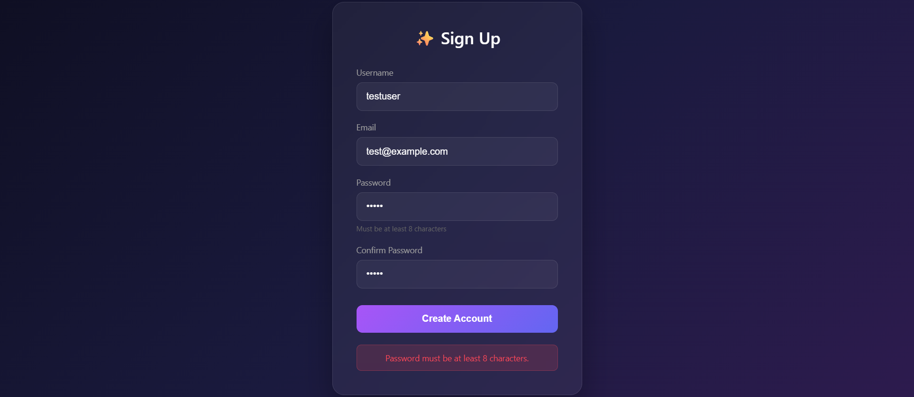
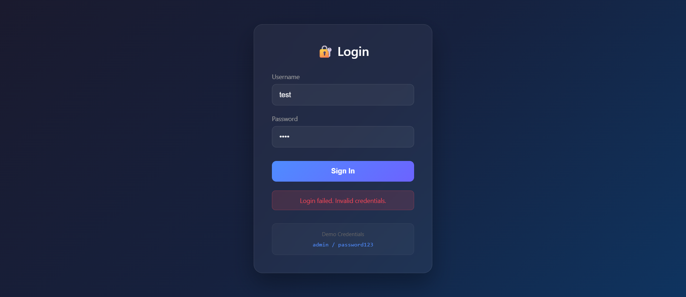

# 🤖 Agentic AI QA Engineer

AI-powered automated testing that converts **natural language requirements** into executable Selenium tests.

## ✨ What It Does

1. **You describe** what to test in plain English
2. **AI generates** the test steps automatically
3. **Selenium runs** the test in a real browser
4. **AI explains** the results (pass or fail)

## 🚀 Quick Start

```bash
# Install dependencies
pip install -r requirements.txt

# Set up your API key
# Create .env file with: GEMINI_API_KEY=your_key

# Start test server (optional - for demo sites)
python serve_test_sites.py

# Run the app
streamlit run app.py
```

## 📸 Demo

| PASS | FAIL |
|------|------|
|  |  |

## 🛠️ Tech Stack

- **AI**: Google Gemini 2.5
- **Automation**: Selenium
- **UI**: Streamlit
- **Language**: Python

---

